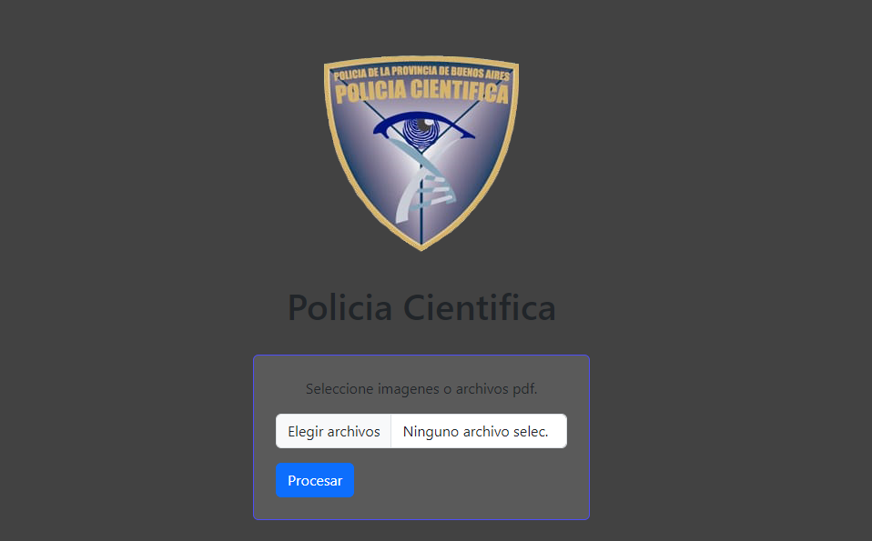

# SmartiFormFIll

<h1 align="center">SmartiFormFIll-Node.js👋</h1>

 

Proyecto personal echo en Node.js! 
Inteligencia artificial empleada: microsoft azure ocr (ComputerVision) 
Poyecto realizado para la policia cientifica; Sede castelar. 
  

El mismo rellena un formulario online a partir de la carga de un archivo pdf o una imagen del formulario manual, 
en el que se desarrollan las actuaciones correspondientes a cada echo; y deben ser virtualizadas y enviadas a la base de datos de la policia de la provincia de Buenos Aires;
pensado a partir de la necesidad de un personal de la policia cientifica; el proyecto fue presentado en la sede de castelar con exito el cual se desempeña de forma local,
el mismo sigue en fase de optimizacion, ya que la inteligencia artificial usada para el reconociemiento de caracteres y el formulario rellenado de forma manual por los oficiales, siempre varia
en cuanto a espacios, letras y/o estilo de escritura. 

